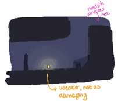
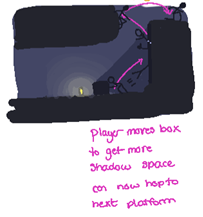

# **Project: Umbra**
*"A 2D Stealth-Action Puzzle-Platformer where Light is an obstacle and Darkness is refuge."*

---

## **Table of Contents**
1. [About the Project](#about-the-project)  
2. [Features](#features)  
3. [Screenshots](#screenshots)  
4. [Getting Started](#getting-started)  
   - [Prerequisites](#prerequisites)  
   - [Installation](#installation)  
5. [Usage](#usage)  
6. [License](#license)  
7. [Team](#team)  

---

## **About the Project**
This project is a side-scrolling 2D platformer developed in Unity. It was made by the (CAP3020 Spring 2025) Dark Valor team for [Convergence 2025](https://www.behance.net/Convergence2025#).

---

## **Features**
- Shadow-based platforming.
- Stealth-Action Combat  
- Pixel art with dynamic lighting effects.  
- Player character with advanced movement mechanics (jumping, wall-sliding, etc.).  
- Enemy AI with simple behaviors.

---

## **Screenshots**

**Gameplay Example:**  
  
*(The imposing light is an obstacle to platforming.)*

  
*(Extend the Darkness to progress in a level.)*

---

## **Getting Started**

### **Prerequisites**
List any dependencies or software needed:  
- Unity **2022.3.56f1 LTS** or higher.  
- Visual Studio (optional, for scripting).  
- Git (for cloning the repository).  

### **Installation**

1. Clone the repository:  
   ```bash
   git clone https://github.com/Dark-Valor/Project-Umbra.git
   ```
2. Open the Unity Hub.  
3. Add the project to Unity Hub:  
   - Click on **Open Project**.  
   - Navigate to the cloned directory and select the folder.  
4. Open the project in Unity.  
5. Press the **Play** button in Unity to start testing the game.

---

## **Usage**
Specific controls or mechanics.

- [INSERT CONTROLS HERE]
- [INSERT MECHANICS EXAMPLE HERE]

---

## **License**
This project is licensed under the MIT License - see the [LICENSE](LICENSE) file for details.

---

## **Team**
**Developer/Dark Valor**  

- GitHub:
  - [@Javier Lopez](https://github.com/JJRaderFTW)  
  - [@Aidan Rudolph](https://github.com/Aidan-Rudolph)
  - [@Seth Sainz](https://github.com/SethSainz)  
  - [@Alana Belnavis-Walters](https://github.com/humonae)  
  - [@Ethan Willis](https://github.com/ethanbwillis)
  - [@Surpris "Jack" Mezardieu](https://github.com/EmptySet-Exe)  


---

## **Acknowledgments**: 
  We would like to thank the following individuals and resources for their contributions and inspiration:
  - **Digital Worlds Institute**: For showcasing this project at Convergence 2025.
  - **Nick Heitzman**: Special thanks to professor Heitzman for providing design feedback and guidance.
  - **Brett Benda**: Special thanks to professor Benda for providing programming feedback and guidance.
  - **Playtesters**: For their valuable feedback in identifying bugs and improving the gameplay experience.
  - **Unity Technologies**: For providing an incredible game development platform.
  - **GitHub**: For hosting this project and enabling collaboration.  
  - **<TUTORIAL_RESOURCE>**: For educational tutorials that guided many of the implemented features.
  - **<ASSET_RESOURCE>**: For additional creative assets.
  - **Stack Overflow Community**: For countless solutions and advice during development.
